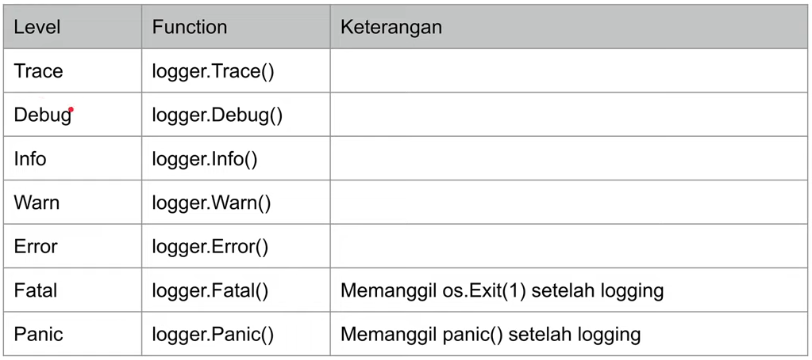

# Belajar-Golang-Logging

Materi Pembelajaran <a href="https://www.youtube.com/watch?v=mqbJ0GmSu3E&list=PL-CtdCApEFH-0i9dzMzLw6FKVrFWv3QvQ&index=16&ab_channel=ProgrammerZamanNow">Programmer Zaman Now</a>

Logging Library

- <a href="https://github.com/sirupsen/logrus">Logrus</a> 🚀
- <a href="https://github.com/uber-go">Zap</a>
- <a href="https://github.com/rs/zerolog">Zerolog</a>
- <a href="https://github.com/sirupsen/logrus/blob/master/entry.go">Logrus Entrty.go</a> 🚀

Instalation `Logrus`

```golang
go get github.com/sirupsen/logrus
```

Level Logging (level dari yang terrendar ke yang tertinggi)

